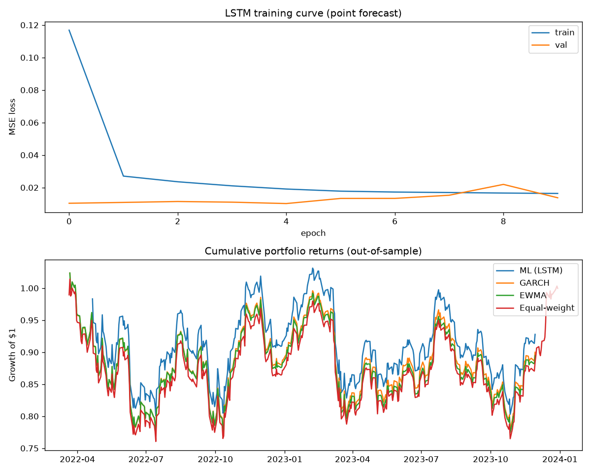

# Volatility Forecasting & Risk-Aware Portfolio Allocation

A project built around forecasting *risk* (volatility and tail risk) rather
than returns, and using those forecasts to drive portfolio construction.
This is deliberately framed around what risk/portfolio management teams
actually do, rather than a "predict the stock price" toy model.

## Why volatility instead of returns?

Daily equity returns are close to unforecastable out-of-sample (this is
close to the efficient-market baseline). Volatility, however, is highly
persistent and clusters in time (large moves follow large moves) — this is
a well-documented, exploitable pattern that classical econometric models
(GARCH, EWMA) already partially capture. The interesting question isn't
"can ML predict vol at all" (yes, trivially, vol is autocorrelated) but
**"can ML beat a well-tuned GARCH/EWMA baseline, and is it well-calibrated
enough to trust for risk management?"** That's the question this project
is built to answer honestly, including when the answer is "no" or "only
sometimes."

## Project structure

```
data_pipeline.py     # data loading (real via yfinance, or synthetic for offline testing)
                      #   + feature engineering + walk-forward split generator
baseline_models.py    # EWMA and GARCH(1,1) volatility forecasts
ml_model.py           # LSTM point-forecast model + LSTM quantile (VaR) model
backtest.py           # risk-parity / min-variance portfolio construction + backtest
evaluate.py           # QLIKE/RMSE forecast comparison + VaR calibration check
main.py               # orchestrates the full pipeline end to end
```

## Setup

```bash
pip install torch arch scikit-learn matplotlib yfinance pandas numpy
```

## Usage

```bash
# Fast, no internet needed - synthetic data with realistic vol clustering
python main.py --demo --tickers AAPL MSFT JPM

# Real data via yfinance (requires internet access)
python main.py --tickers AAPL MSFT JPM XOM PG --start 2015-01-01 --end 2024-01-01
```

Outputs: `results.png` (training curve + cumulative portfolio return
comparison) and `forecast_leaderboard.csv` (RMSE/QLIKE by model).



## What each piece actually does

**Two separate targets, on purpose:**
- `target_fwd_rvol`: forward N-day realized volatility (annualized). Used
  for the point-forecast model and compared directly against GARCH/EWMA.
- `target_next_return`: next single-day log return. Used for the VaR
  quantile model. **These are not interchangeable** — a model trained to
  predict a low quantile of forward *volatility* is not a valid VaR
  estimate, since VaR is a statement about the return distribution, not
  the vol forecast distribution. Conflating the two is a common mistake
  and worth being able to explain if asked.

**Walk-forward validation everywhere.** No random train/test splits on
time series — the split, baseline refitting, and LSTM train/val split are
all done on the date axis with train always preceding test.

**Calibration check on the VaR model** (`evaluate.var_calibration`): checks
whether a "5% VaR" actually gets breached ~5% of the time out of sample.
This is the difference between a model that's decorative and one you could
actually defend in a risk committee meeting. Don't skip this step, and
don't be surprised or discouraged if calibration is imperfect — reporting
that honestly, and discussing *why* (regime shift, small sample, non-
stationarity), is more valuable to a hiring manager than a suspiciously
perfect result.

**Risk-parity backtest with frictions.** Portfolio weights are inverse-vol
weighted based on each model's forecast, rebalanced periodically, with
transaction costs and a 1-day trading lag (you can't trade on same-day
information). A `min_variance` scheme (with shrinkage-adjusted covariance)
is also implemented in `backtest.py` if you want to extend beyond
risk-parity.

## Results

**Setup:** Ran on JPM, BAC, WFC, GS, and MS (5 major US banks) from
2018-01-01 to 2024-01-01. Out-of-sample test window: March 2022 -
November 2023.

**Forecast accuracy:** The LSTM outperformed both classical baselines on
combined QLIKE (0.147 vs. 0.186 for GARCH and 0.222 for EWMA) and won on
all 5 individual tickers. This held up consistently across runs.

**VaR calibration:** Mixed and run-dependent. In this run, only BAC was
well-calibrated; GS, JPM, MS, and WFC all under-flagged risk (actual
breach rates of 1-3% against a 5% target, vs. a cleaner calibration
picture in an earlier run with a less-regularized model). This is a
worthwhile trade-off to be transparent about: the regularization added to
fix LSTM overfitting (smaller hidden layer, weight decay, early stopping)
likely made the quantile model more conservative than before. Worth
investigating further rather than treating either run as final.

**Portfolio performance and regime breakdown:** Despite the LSTM having
the most accurate individual forecasts, the LSTM-driven risk-parity
portfolio underperformed a naive equal-weight benchmark on a risk-adjusted
basis over the full test period (Sharpe -0.06 vs. 0.12), as did GARCH
(-0.13) and EWMA (-0.14). Breaking the backtest into named sub-periods
clarifies *why*:

| Regime | ML (LSTM) | GARCH | EWMA | Equal-weight |
|---|---|---|---|---|
| Rate-hike selloff (2022) | -1.01 | -1.08 | -1.10 | -1.16 |
| 2023 banking crisis | -2.20 | -2.16 | -2.24 | -2.17 |
| Recovery (2023) | 0.81 | 0.82 | 0.86 | **1.68** |

(Sharpe ratios shown per regime.)

During the March 2023 regional banking crisis, all four strategies
collapsed to nearly identical Sharpe ratios (-2.16 to -2.24) — when
correlations spike toward 1 during a systemic shock, per-asset volatility
forecasts stop mattering, since every stock sells off together regardless
of its individual risk profile. The real separation shows up in the
**recovery period**, where equal-weight (+34% annualized) clearly
outperformed every forecast-driven strategy (+16-17%). This makes sense
structurally: risk-parity shifts weight away from whichever stock
currently looks most volatile — but the stocks flagged as riskiest during
a crisis are often exactly the ones that rebound hardest once it passes.
Risk-parity's own logic keeps it underweight in precisely the names that
drive the recovery rally, causing it to structurally lag.

**Takeaway:** Better volatility forecasting (the LSTM's clear win on
accuracy) did not translate into better portfolio outcomes here — not
because risk-parity mismanaged the crisis itself (every strategy fared
equally badly there), but because risk-parity's inverse-volatility
weighting works against it during the snap-back recovery that follows a
crisis. This suggests risk-parity would benefit from a regime-aware
adjustment — e.g. temporarily relaxing the inverse-vol weighting, or
blending toward equal-weight, once a crisis period is identified as
ending — rather than applying the same allocation logic uniformly across
very different market conditions.

## Known limitations (be upfront about these — it's a strength, not a weakness)

- The GARCH baseline is refit every 21 days, not daily, for speed. Daily
  refitting would be more standard in production but is slow here.
- The min-variance scheme uses a simple shrinkage-to-identity correlation
  estimate. A production system would likely use a factor model (e.g.
  Barra-style) or Ledoit-Wolf shrinkage instead.
- Synthetic data is provided for offline testing only — it has the right
  *stylized facts* (vol clustering, fat tails) but is not a substitute for
  real market data when drawing conclusions.
- VaR calibration on a single backtest window is a small sample for a 5%
  tail event — treat calibration results directionally, not as a precise
  statistical test, unless you extend the backtest period substantially.

## Extending this for a stronger portfolio piece

- Add cross-sectional features (sector, size, momentum factors) rather
  than per-ticker univariate models.
- Try an EGARCH or GJR-GARCH baseline to capture leverage effects
  (volatility responds asymmetrically to positive vs negative returns).
- Extend the quantile model to multiple quantiles (5%, 25%, 50%, 75%, 95%)
  to get a full predictive distribution, not just a single VaR line.
- Stress-test the backtest across distinct regimes (2018 vol spike, 2020
  COVID crash, 2022 rate hikes) as separate reported sub-periods rather
  than one aggregate number — this is what actual risk teams do.
